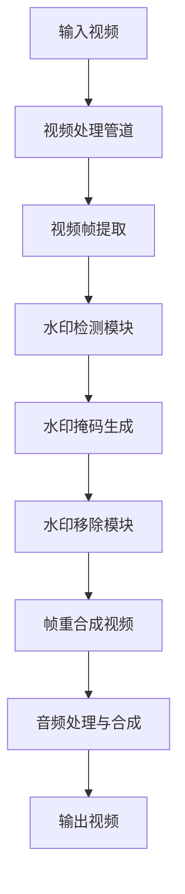

# Sora2WatermarkRemover 技术实现方案

## 1. 系统架构

### 1.1 整体架构概述

Sora2WatermarkRemover系统采用模块化设计，主要由以下核心组件构成：

```
Sora2WatermarkRemover
├── 水印检测模块 (Sora2WaterMarkDetector)
├── 水印移除模块 (WaterMarkRemover)
├── 视频处理管道 (VideoPipeline)
└── 用户界面层
    ├── 命令行接口
    ├── Web界面 (Streamlit)
    ├── 桌面GUI (PyQt5)
    └── Web服务 (FastAPI)
```

### 1.2 核心组件关系

各组件之间通过明确的接口进行交互，形成完整的处理流水线：



## 2. 技术栈与依赖

### 2.1 主要技术栈

| 技术/库 | 用途 | 版本要求 |
|---------|------|----------|
| Python | 主要开发语言 | 3.9+ |
| PyTorch | 深度学习框架 | 2.0+ |
| Ultralytics YOLOv11 | 水印检测模型 | 最新版 |
| LAMA | 图像修复模型 | 最新版 |
| FFmpeg | 视频处理工具 | 4.0+ |
| NumPy | 数值计算 | 1.20+ |
| OpenCV | 图像处理 | 4.5+ |
| Streamlit | Web界面 | 1.20+ |
| FastAPI | Web服务 | 0.95+ |
| PyQt5 | 桌面GUI | 5.15+ |

### 2.2 硬件要求

- **CPU模式**：支持所有现代CPU
- **GPU加速**：
  - NVIDIA GPU (CUDA兼容)
  - Apple Silicon (MPS支持)

## 3. 核心算法实现

### 3.1 水印检测算法

#### 3.1.1 YOLOv11模型定制

我们使用YOLOv11s架构训练了专门针对Sora2水印的检测模型：

- **数据集**：使用自定义标注的Sora2水印数据集，包含各种场景下的水印样本
- **训练策略**：
  - 学习率：0.001，采用余弦退火调度
  - 批量大小：16
  - 训练轮次：100
  - 数据增强：随机旋转、缩放、翻转、亮度调整

- **模型特点**：
  - 优化的锚框尺寸适合Sora2水印比例
  - 专注于高召回率的检测性能
  - 轻量化设计，适合实时处理

#### 3.1.2 检测后处理

```python
# 检测后处理伪代码
def post_process_detections(detections, confidence_threshold=0.5):
    # 过滤低置信度检测
    valid_detections = [d for d in detections if d.confidence > confidence_threshold]
    
    # 非极大值抑制(NMS)
    filtered_detections = apply_nms(valid_detections, iou_threshold=0.4)
    
    # 生成水印掩码
    masks = generate_masks(filtered_detections, frame_shape)
    
    return masks
```

### 3.2 水印移除算法

#### 3.2.1 LAMA模型应用

我们采用LAMA（Large Mask Inpainting）模型进行水印区域的智能填充：

- **模型原理**：
  - 基于Transformer的架构，能够捕捉长距离依赖
  - 大感受野设计，适合处理大面积缺失区域
  - 残差连接设计，保留原始图像细节

- **优化策略**：
  - 调整输入分辨率以平衡速度和质量
  - 局部区域处理，只对水印部分进行修复
  - 边缘优化，确保修复区域与周围平滑过渡

#### 3.2.2 修复后处理

```python
# 修复后处理伪代码
def refine_inpainting_result(original_frame, inpainted_frame, mask):
    # 边缘平滑
    blended_frame = apply_edge_blending(original_frame, inpainted_frame, mask)
    
    # 色彩一致性调整
    color_adjusted = match_color_histogram(blended_frame, original_frame, mask)
    
    # 细节增强
    final_frame = enhance_details(color_adjusted, original_frame, mask)
    
    return final_frame
```

### 3.3 视频处理算法

#### 3.3.1 帧处理流水线

```python
# 帧处理流水线伪代码
class FramePipeline:
    def __init__(self, detector, remover):
        self.detector = detector
        self.remover = remover
    
    def process_frame(self, frame):
        # 1. 水印检测
        masks = self.detector.detect(frame)
        
        # 2. 水印移除
        if masks.any():
            # 对每个水印区域进行移除
            for mask in masks:
                frame = self.remover.remove(frame, mask)
        
        return frame
```

#### 3.3.2 视频编码优化

- **高效编码参数**：
  - 编码器：H.264/H.265
  - 预设：medium（平衡速度和质量）
  - 画质控制：CRF 23（视觉质量与文件大小平衡）

- **音频处理**：
  - 无损提取原始音频
  - 与处理后视频精确同步

## 4. 关键实现细节

### 4.1 设备自适应机制

```python
# 设备自适应伪代码
def select_device():
    """自动选择最优计算设备"""
    # 检查CUDA可用性
    if torch.cuda.is_available():
        return torch.device("cuda")
    # 检查Apple Silicon MPS可用性
    elif hasattr(torch.backends, 'mps') and torch.backends.mps.is_available():
        return torch.device("mps")
    # 回退到CPU
    else:
        return torch.device("cpu")
```

### 4.2 批处理优化

- **并行帧处理**：使用多线程或多进程并行处理视频帧
- **内存管理**：
  - 流式处理，避免一次性加载全部帧
  - 处理完成后及时释放资源
  - 对大分辨率视频采用分块处理策略

### 4.3 错误处理与恢复机制

```python
# 错误处理伪代码
def safe_process_frame(frame, pipeline, fallback_strategy="copy_prev"):
    try:
        # 尝试正常处理
        return pipeline.process_frame(frame)
    except Exception as e:
        log_error(f"Frame processing error: {e}")
        # 应用降级策略
        if fallback_strategy == "copy_prev" and has_prev_frame():
            return get_prev_frame()  # 使用前一帧结果
        elif fallback_strategy == "original":
            return frame  # 使用原始帧
        else:
            # 尝试简化处理
            return simplified_process(frame)
```

## 5. 模块详细设计

### 5.1 水印检测模块 (Sora2WaterMarkDetector)

#### 5.1.1 类结构

```python
class Sora2WaterMarkDetector:
    def __init__(self, model_path="resources/best.pt", confidence_threshold=0.5):
        self.model = self._load_model(model_path)
        self.confidence_threshold = confidence_threshold
    
    def _load_model(self, model_path):
        # 加载并初始化YOLO模型
        pass
    
    def detect(self, frame):
        # 检测帧中的水印
        pass
    
    def generate_masks(self, detections, frame_shape):
        # 根据检测结果生成水印掩码
        pass
```

#### 5.1.2 核心方法

- **_load_model()**：加载预训练的YOLO模型，处理模型缓存和下载
- **detect()**：执行水印检测，返回检测框和置信度
- **generate_masks()**：将检测框转换为二值掩码

### 5.2 水印移除模块 (WaterMarkRemover)

#### 5.2.1 类结构

```python
class WaterMarkRemover:
    def __init__(self, model_type="lama", device=None):
        self.model = self._load_model(model_type)
        self.device = device or select_device()
    
    def _load_model(self, model_type):
        # 加载并初始化修复模型
        pass
    
    def remove(self, frame, mask):
        # 使用掩码移除水印
        pass
    
    def _refine_result(self, original, inpainted, mask):
        # 优化修复结果
        pass
```

#### 5.2.2 核心方法

- **_load_model()**：加载LAMA图像修复模型
- **remove()**：执行水印移除，生成修复后的图像
- **_refine_result()**：对修复结果进行后处理，提升视觉质量

### 5.3 视频处理管道 (VideoPipeline)

#### 5.3.1 类结构

```python
class VideoPipeline:
    def __init__(self, detector, remover, temp_dir="./temp"):
        self.detector = detector
        self.remover = remover
        self.temp_dir = temp_dir
    
    def process_video(self, input_path, output_path, progress_callback=None):
        # 完整视频处理流程
        pass
    
    def _extract_frames_audio(self, video_path):
        # 提取视频帧和音频
        pass
    
    def _process_frames(self, frames, progress_callback=None):
        # 批量处理帧
        pass
    
    def _reconstruct_video(self, processed_frames, audio_path, output_path):
        # 重建视频并添加音频
        pass
```

#### 5.3.2 核心方法

- **process_video()**：协调整个视频处理流程
- **_extract_frames_audio()**：使用FFmpeg提取视频帧和音频
- **_process_frames()**：对提取的帧进行批处理
- **_reconstruct_video()**：将处理后的帧重新合成为视频

## 6. 性能优化策略

### 6.1 模型优化

- **模型量化**：应用INT8量化减小模型体积和加速推理
- **模型剪枝**：移除冗余神经元，保持性能的同时减小模型大小
- **知识蒸馏**：从大模型蒸馏到小模型，平衡性能和效率

### 6.2 计算优化

- **TensorRT加速**：对支持的模型使用TensorRT进行推理加速
- **ONNX Runtime**：使用ONNX Runtime优化跨平台推理性能
- **批处理大小优化**：根据硬件配置动态调整批处理大小

### 6.3 内存优化

- **懒加载**：按需加载模型和数据
- **梯度检查点**：减少内存占用，特别是在处理大分辨率视频时
- **周期性垃圾回收**：主动触发Python垃圾回收，避免内存泄漏

## 7. 扩展性设计

### 7.1 模型扩展接口

系统设计了统一的模型接口，支持轻松替换或升级检测和修复模型：

```python
# 模型接口示例
class DetectionModelInterface:
    def detect(self, frame):
        """检测图像中的水印"""
        pass
    
    def generate_masks(self, detections, frame_shape):
        """生成水印掩码"""
        pass

class InpaintingModelInterface:
    def inpaint(self, image, mask):
        """修复图像中的缺失区域"""
        pass
```

### 7.2 新功能集成路径

- **处理流程扩展**：通过中间件模式集成新的处理步骤
- **用户界面扩展**：模块化设计允许轻松添加新的用户交互方式
- **配置管理**：使用YAML/JSON配置文件，支持灵活的参数调整

## 8. 相关文档

- [产品设计PRD](产品设计PRD.md)：详细的产品需求说明
- [工程项目说明书](工程项目说明书.md)：项目结构和开发指南
- [README-zh.md](README-zh.md)：用户使用指南和项目概述